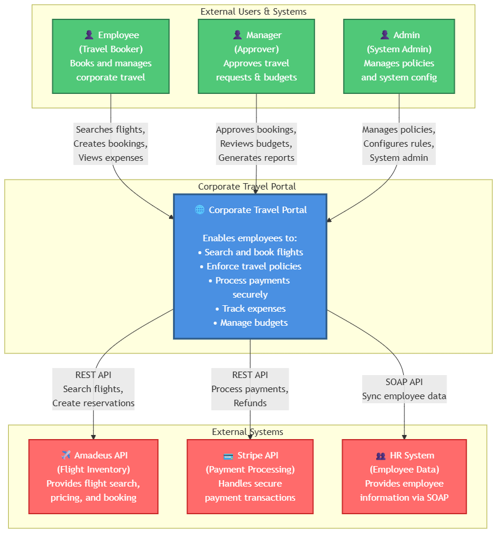
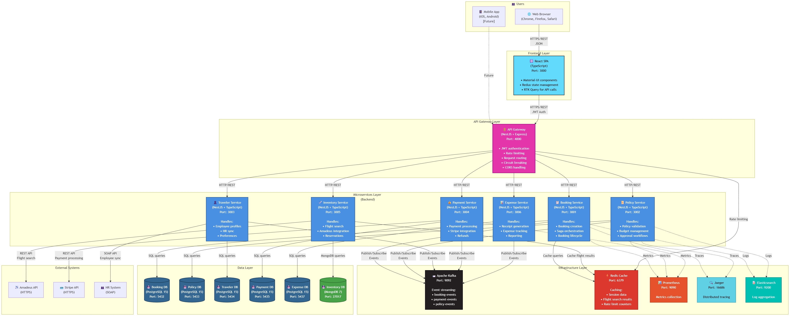
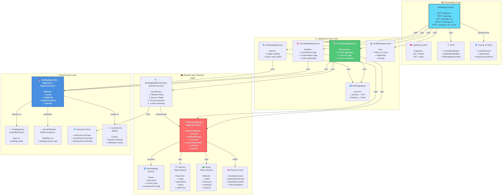
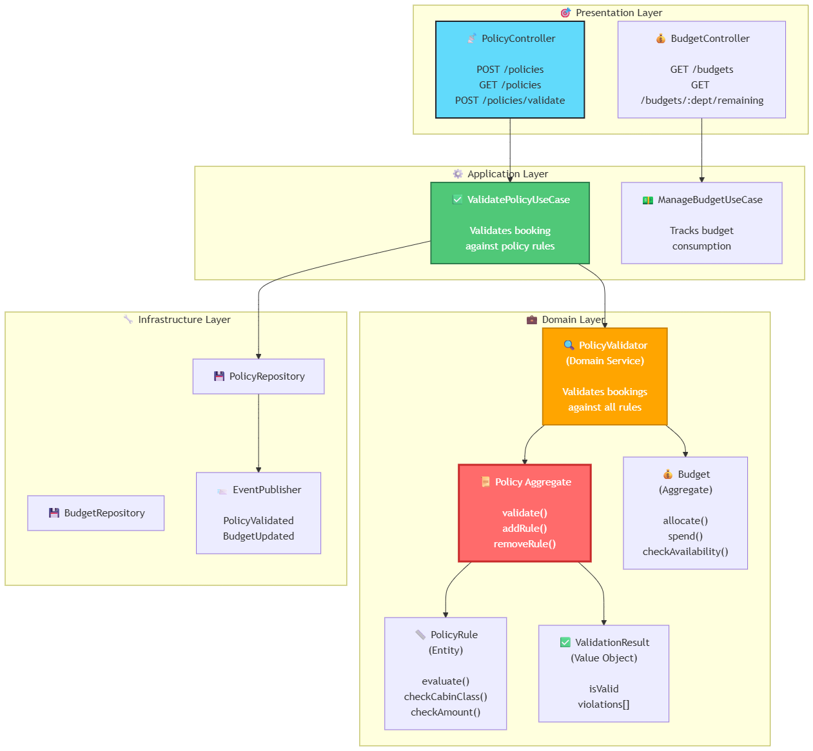
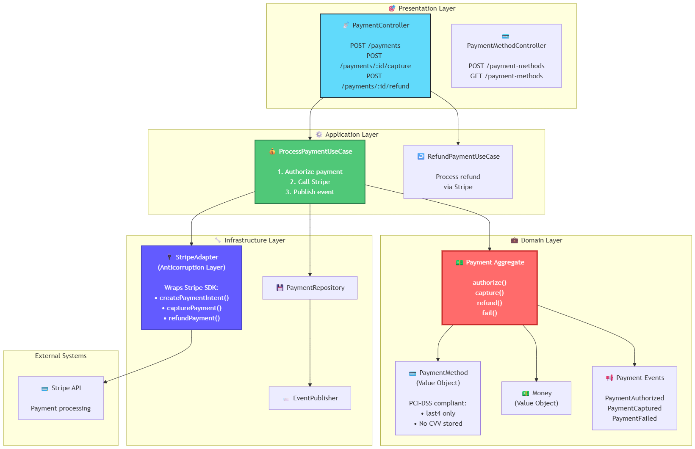
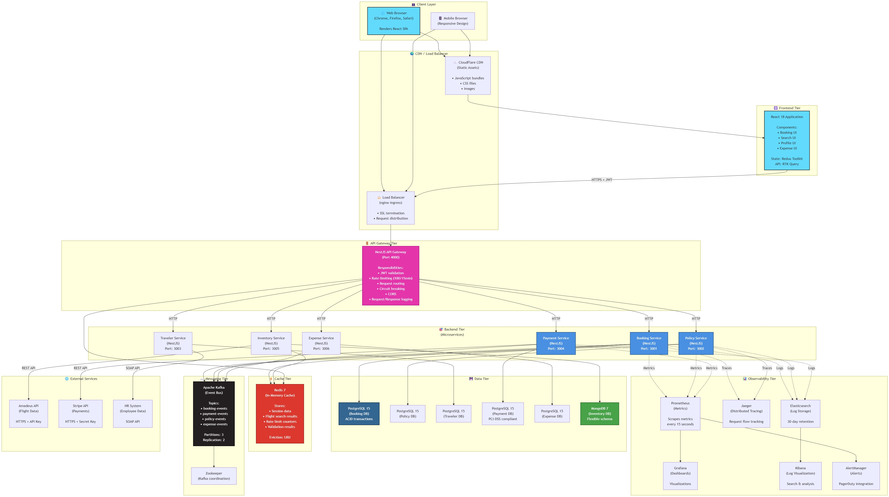
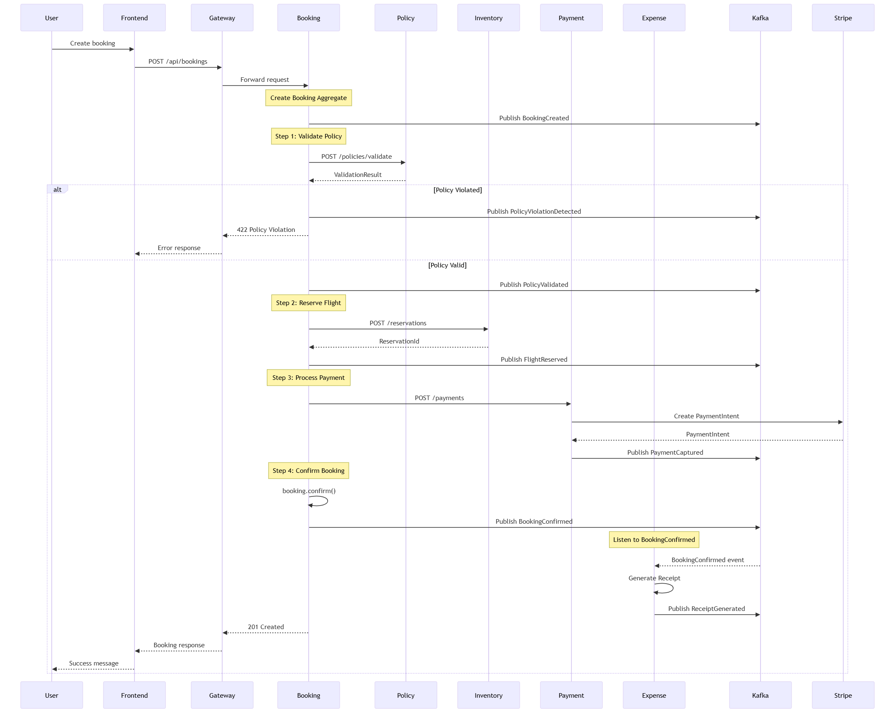
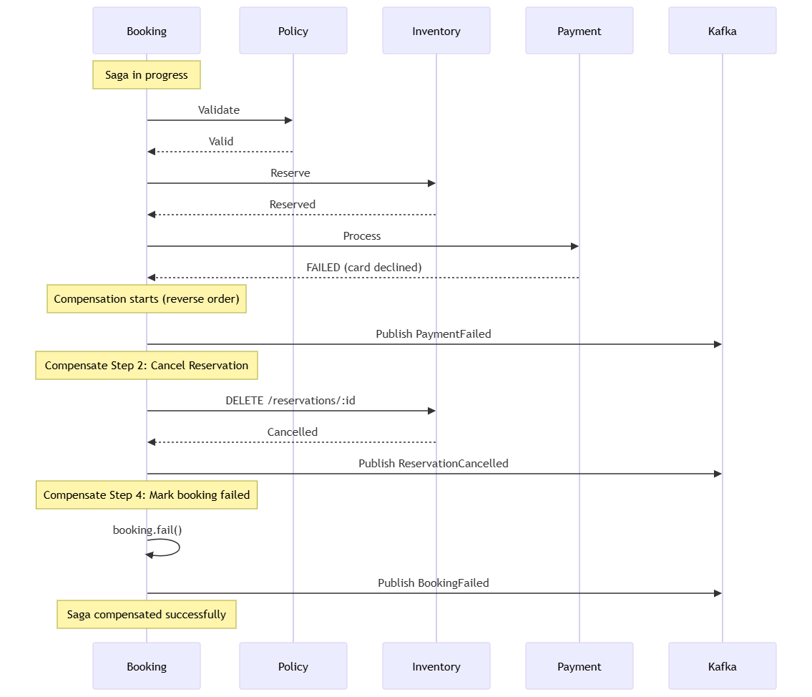
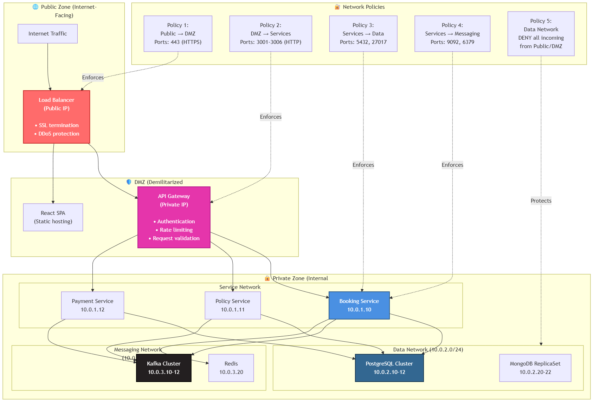
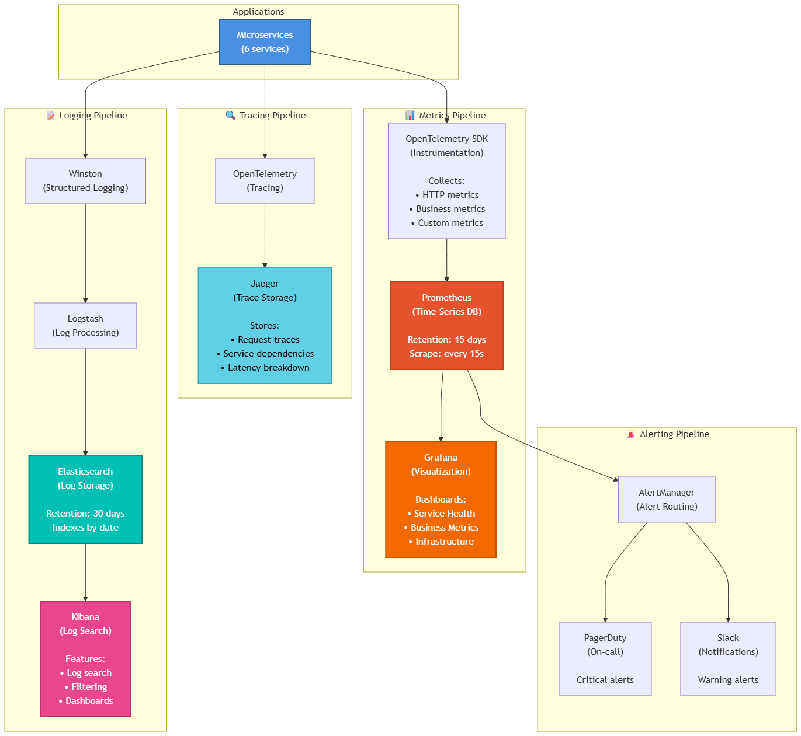

# Architecture Diagrams - Corporate Travel Portal

**Version**: 2.0  
**Date**: May 2026  
**Architecture**: Domain-Driven Design + Microservices

This document contains comprehensive architecture diagrams using the C4 model and additional technical architecture views.

---

## Table of Contents

1. [C4 Level 1: System Context Diagram](#c4-level-1-system-context-diagram)
2. [C4 Level 2: Container Diagram](#c4-level-2-container-diagram)
3. [C4 Level 3: Component Diagrams](#c4-level-3-component-diagrams)
   - [Booking Service Components](#booking-service-components)
   - [Policy Service Components](#policy-service-components)
   - [Payment Service Components](#payment-service-components)
4. [Technical Architecture Diagram](#technical-architecture-diagram)
5. [Data Flow Diagrams](#data-flow-diagrams)
6. [Deployment Architecture](#deployment-architecture)
7. [Network Architecture](#network-architecture)

---

## C4 Level 1: System Context Diagram

This diagram shows the Corporate Travel Portal in the context of users and external systems.



**Key Relationships**:

| Actor/System | Interaction | Purpose |
|--------------|-------------|---------|
| Employee | Uses Portal | Search flights, book travel, view expenses |
| Manager | Uses Portal | Approve bookings, review budgets, generate reports |
| Admin | Uses Portal | Configure policies, manage system settings |
| Portal | Calls Amadeus API | Search available flights, create reservations |
| Portal | Calls Stripe API | Process payments securely, handle refunds |
| Portal | Calls HR System | Synchronize employee data (nightly batch) |

---

## C4 Level 2: Container Diagram

This diagram shows the high-level technology choices and how containers communicate.



**Technology Summary**:

| Container | Technology | Port | Purpose |
|-----------|------------|------|---------|
| React SPA | React 18 + TypeScript | 3000 | User interface |
| API Gateway | NestJS + Express | 4000 | Single entry point, auth, routing |
| Booking Service | NestJS + TypeScript | 3001 | Core booking logic |
| Policy Service | NestJS + TypeScript | 3002 | Policy validation |
| Traveler Service | NestJS + TypeScript | 3003 | Employee management |
| Payment Service | NestJS + TypeScript | 3004 | Payment processing |
| Inventory Service | NestJS + TypeScript | 3005 | Flight search |
| Expense Service | NestJS + TypeScript | 3006 | Expense tracking |
| PostgreSQL | PostgreSQL 15 | 5432-5437 | Transactional data |
| MongoDB | MongoDB 7 | 27017 | Document storage |
| Kafka | Apache Kafka 3 | 9092 | Event streaming |
| Redis | Redis 7 | 6379 | Caching |

---

## C4 Level 3: Component Diagrams

### Booking Service Components

This diagram shows the internal structure of the Booking Service using DDD layered architecture.



**Layer Responsibilities**:

| Layer | Responsibility | Key Components |
|-------|----------------|----------------|
| Presentation | HTTP handling, validation | Controllers, DTOs, Guards |
| Application | Use case orchestration | Use Cases, Mappers |
| Domain | Business logic | Aggregates, Entities, Value Objects, Domain Services |
| Infrastructure | External concerns | Repositories, Database, Kafka, External APIs |

---

### Policy Service Components  



---

### Payment Service Components  



**Anticorruption Layer (ACL)**:
- `StripeAdapter` isolates domain from external API changes
- Converts Stripe responses to domain objects
- Handles Stripe-specific errors

---

## Technical Architecture Diagram architecture-diagram

This diagram shows the complete technical stack from frontend to infrastructure.



**Technology Flow**:

```
User Request Flow:
Browser → CDN (static assets) → React App
Browser → Load Balancer → API Gateway → Service → Database
Service → Kafka (async events) → Other Services

Observability Flow:
Service → Prometheus (metrics) → Grafana (visualization)
Service → Jaeger (traces)
Service → Elasticsearch (logs) → Kibana (search)
```

---

## Data Flow Diagrams

### Booking Flow (Saga Pattern) booking-flow-saga-pattern



### Saga Compensation Flow (Failure Scenario)



---

## Deployment Architecture

### Kubernetes Deployment

  

**Kubernetes Resources**:

| Resource Type | Count | Purpose |
|---------------|-------|---------|
| Namespaces | 5 | Logical separation |
| Deployments | 9 | Stateless apps |
| StatefulSets | 5 | Stateful apps (databases, Kafka) |
| Services | 12 | Network abstraction |
| Ingress | 1 | External access |
| ConfigMaps | 3 | Configuration |
| Secrets | 5 | Sensitive data |
| PersistentVolumeClaims | 11 | Storage |
| HorizontalPodAutoscalers | 6 | Auto-scaling |

---

## Network Architecture

### Network Segmentation

 

**Security Policies**:

| Source | Destination | Protocol | Port | Purpose |
|--------|-------------|----------|------|---------|
| Internet | Load Balancer | HTTPS | 443 | User traffic |
| Load Balancer | API Gateway | HTTP | 4000 | Internal routing |
| API Gateway | Services | HTTP | 3001-3006 | Service calls |
| Services | PostgreSQL | TCP | 5432 | Database queries |
| Services | MongoDB | TCP | 27017 | Database queries |
| Services | Kafka | TCP | 9092 | Event streaming |
| Services | Redis | TCP | 6379 | Caching |
| **Data Network** | **ANY** | **DENY** | **ALL** | **Isolation** |

---

## Monitoring Dashboard Architecture

 

**Observability Metrics**:

```
Service Health Metrics:
• http_requests_total (counter)
• http_request_duration_seconds (histogram)
• http_request_errors_total (counter)

Business Metrics:
• bookings_created_total (counter)
• bookings_confirmed_total (counter)
• bookings_failed_total (counter by reason)
• payment_amount_total (counter)

Infrastructure Metrics:
• nodejs_heap_size_total_bytes (gauge)
• nodejs_active_handles (gauge)
• postgres_connections_active (gauge)
• kafka_consumer_lag (gauge)
```

---

## Summary

This comprehensive architecture diagram set provides:

✅ **C4 Level 1**: System context showing users and external systems  
✅ **C4 Level 2**: Container diagram with all microservices and databases  
✅ **C4 Level 3**: Component diagrams for Booking, Policy, and Payment services  
✅ **Technical Architecture**: Complete stack from frontend to infrastructure  
✅ **Data Flow**: Booking saga with success and failure scenarios  
✅ **Deployment**: Kubernetes architecture with all resources  
✅ **Network**: Security zones and network policies  
✅ **Monitoring**: Observability pipeline with metrics, traces, and logs  

**Diagram Count**: 10 comprehensive diagrams  
**Total Components**: 50+ components documented  
**Layers Covered**: All 7 layers (Client → Frontend → Gateway → Services → Data → Messaging → Observability)

These diagrams are production-ready and can be used for:
- Developer onboarding
- Architecture reviews
- Technical documentation
- Stakeholder presentations
- Deployment planning
- Security audits

---

**Document Owner**: Architecture Team  
**Last Updated**: 2026-05-01  
**Review Cycle**: Quarterly
